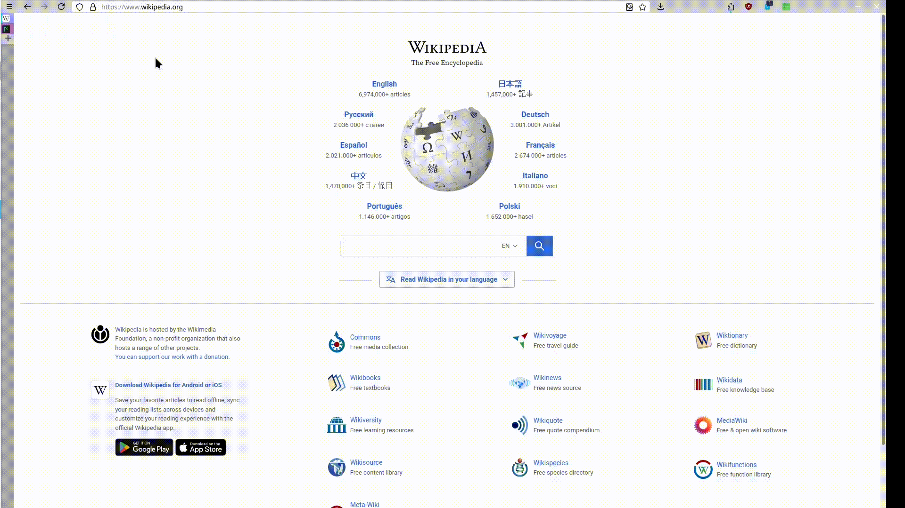

# TSTMinimize
Configure Firefox to give more space to content by hiding Firefox interface elements or making them thinner.

- Hide tabs toolbar and use Tree Style Tab sidebar instead.
- Automatically collapse and expand Tree Style Tab sidebar on mouse hover.
- Move Menu button to the right side of the toolbar and add extensions for Close and Minimize buttons.

# Prerequisites
Install Firefox add-on Tree Style Tab. Open add-on properties and select the Photon theme.
Scroll down to the Advanced settings, expand them and click Load from File button. In the dialog select the file TST_settings.txt

# Install
First enable using userChrome.css file if that has not been done yet:
Open about:config page.
A dialog will warn you, but ignore it, just do it press the I accept the risk! button.
Search for these and set each of them to True:
- toolkit.legacyUserProfileCustomizations.stylesheets
- layers.acceleration.force-enabled
- gfx.webrender.all
- gfx.webrender.enabled
- layout.css.backdrop-filter.enabled
- svg.context-properties.content.enabled

Open Firefox profile directory by clicking Menu button -> Help -> More troubleshoot information and then clicking the "Open directory" in the "Profile Directory" line.

Create subdirectory called chrome if it doesnt exist.

Put the userChrome.css file into the directory or merge it if already exists (make backup copy).

Restart Firefox to apply changes.
